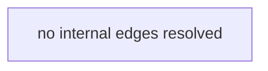

# Knowledge Graph

> Generated by Graphify on 2026-08-30 10:57.
> Do not read this file to answer a structural question — query it:
> `./.agent-spec/bin/graphify-cli.py query --file <path>`

**Stack**: Unknown · **Files**: 4 · **Internal edges**: 0 · **Cycles**: 0

## Most depended-upon files
| File | Dependents |
|------|-----------|
| | |

## Busiest edges

## Import cycles
- none detected

## Orphans (no internal imports either way)
- `bin/agent-spec-digest.py`
- `bin/agent-spec-settings.py`
- `bin/graphify-build.py`
- `bin/graphify-cli.py`
