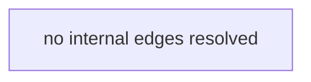

# Knowledge Graph

> Generated by Graphify on 2026-08-31 16:53.
> Do not read this file to answer a structural question — query it:
> `./.agent-spec/bin/graphify-cli.py query --file <path>`

**Stack**: Unknown · **Files**: 9 · **Internal edges**: 0 · **Cycles**: 0
**Services**: 0 · **Integration edges**: 0 · **Endpoints**: 0 · **Topics**: 0 · **Layer violations**: 0

## Layers
- **test** — 7 files
- **unknown** — 2 files

## Most depended-upon files
| File | Dependents |
|------|-----------|
| | |

## Busiest edges

## Import cycles
- none detected

## Orphans (no internal imports either way)
- `bin/agent-spec-digest.py`
- `bin/agent-spec-gate.py`
- `bin/agent-spec-memory.py`
- `bin/agent-spec-settings.py`
- `bin/agent-spec-tokens.py`
- `bin/agent-spec-wire-recorder.py`
- `bin/graphify-build.py`
- `bin/graphify-cli.py`
- `bin/test_gate_status_json.py`
