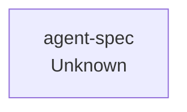

# Knowledge Graph — agent-spec

**Stack**: Unknown | **Indexed**: 2026-05-10 | **Files**: Java=0 TS=0 Tests=0

## Architecture Diagram

> 💡 Ask your agent: *"Update the knowledge graph based on the project structure"*
> Or run the `/index-project` skill to have the agent fill this in.

## Node Inventory
| Node | Type | Path | Updated |
|------|------|------|---------|
| _(run /index-project to populate)_ | | | 2026-05-10 |

## Arrow Legend
| Notation | Meaning |
|----------|---------|
| `A --> B` | A depends on B |
| `A -->|owns| B` | A owns B |
| `A -->|uses| B` | A uses B at runtime |
| `A -.->|optional| B` | A optionally uses B |

*Managed by agent-spec | Last indexed: 2026-05-10*
