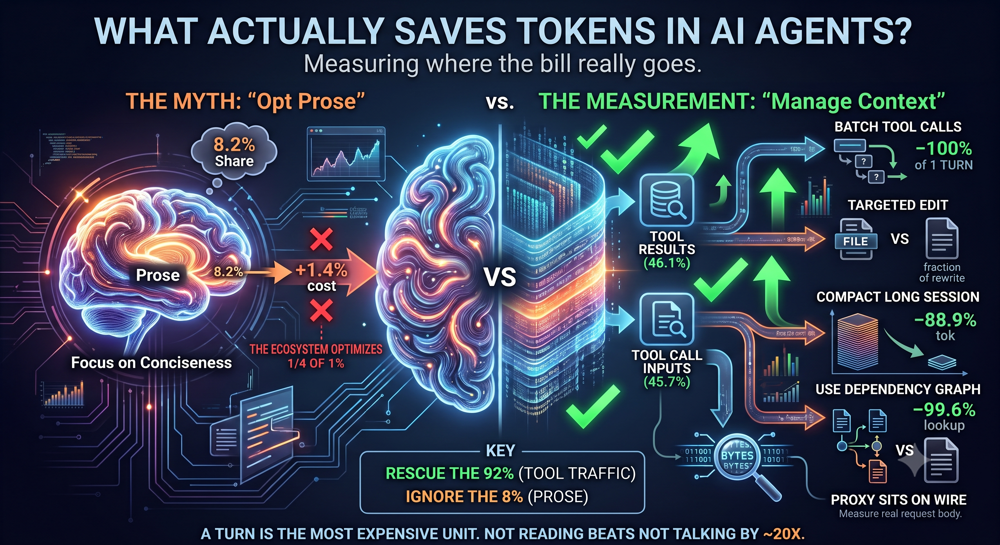

# 🚀 agent-spec

> **Stop "vibe coding." Start engineering.**

[](https://opensource.org/licenses/MIT)
[](#)
[](#)

A framework that installs into your repo and turns a hallucination-prone coding assistant
into a disciplined engineer: a queryable map of your architecture, a gated SDLC pipeline,
project memory that survives a new chat, strict confidence scoring, and 25 prefixed skills
that work in Claude Code, Cursor and Antigravity.

---

## Status

Unreleased work on `main`, on top of 1.0.0. What is in place today:

| | |
|---|---|
| **Router** | `/agent-spec` reads the pipeline state and hands off to exactly one skill |
| **Graph** | services, layers, HTTP and broker edges, incremental indexing — not just imports |
| **Pipeline** | nine gates with state on disk, and requirement traceability from gate 0 to gate 8 |
| **Memory** | a bounded fact store read at every session start, plus a rotating narrative snapshot |
| **Token cost** | ~2,190 tokens of always-on context; the session digest replaced a four-file read |
| **Tests** | `bin/agent-spec-selftest.sh` — 117 assertions across Python, Java-microservice and Node fixtures |
| **Measurement** | `bin/agent-spec-tokens.py` reads the real session transcript — measured buckets, not bytes ÷ 4 |
| **Subagents** | `agent-spec-search` and `agent-spec-verify`, pinned to a cheap model, so broad sweeps and noisy test output never enter the main context |

Known gaps, stated rather than hidden:

- Layer classification is a path and filename heuristic. It is reported, never enforced.
- HTTP integration edges resolve only when the called host matches a detected service
  name. A gateway, a config-driven base URL, or a discovery name that differs from the
  directory name is invisible. Broker edges have no such limitation.
- `from pkg import a` resolves to `pkg/__init__.py`, not `pkg/a.py`.
- Whether Claude Code picks up `outputStyle: "agent-spec"` from a freshly written
  `settings.json` has not been observed in a live session.

See [CHANGELOG.md](CHANGELOG.md) for the full list.

---

## Install

`agent-spec` uses a **hybrid architecture**. Running the install command does two things simultaneously:
1. **Machine-wide (Global):** Installs the 25 skills into your home directory so every project on your machine can access the tools.
2. **Project-specific (Local):** Initializes `.agent-spec/` (knowledge graph, pipeline) and `.cursor/rules/` strictly in your current working directory.

**Option A: Install from the web (Standard)**
Navigate to your target project folder and run:
```bash
curl -sSL https://raw.githubusercontent.com/pawanraocse/agent-spec/main/bin/install.sh | bash
```

**Option B: Install from a local clone (Faster for multiple projects)**
If you already have `agent-spec` cloned on your machine, navigate to your target project folder and run your local script:
```bash
/path/to/your/clone/agent-spec/bin/install.sh
```

**Update:** re-run the exact same command. Run it in an empty directory and you get a new project, git and all.

Installing also writes an output style, two cheap-model subagents and two hooks into
each `.claude` home, merged into any existing `settings.json` without touching what is already there.
`SessionStart` puts a short project digest — stack, graph size, current gate, last
session — in front of every session, so no session begins by reading four files to work
out where it is. `PreToolUse` declines a whole-file read, a rewrite of a file that already
exists, or an unfiltered diff, once per target per session, so the retry always goes
through when the expensive form is genuinely what you want.

Then restart your agent (skills are read at session start) and type **`/agent-spec-onboard`**. It
reads the graph and the manifest, writes `PROJECT-INDEX.md` and `CONSTITUTION.md` from
what is actually in your repo, and never runs again — so no later session has to
rediscover the project.

<details>
<summary>Options</summary>

| Flag | Effect |
|---|---|
| `--skills-only` | Machine-wide skills, touch nothing in this directory |
| `--project-only` | This directory only |
| `--project-skills` | Also commit skills into `.claude/` and `.cursor/` (team repos) |
| `--lean` | Skip the 5 SDLC-design skills |
| `--force` | Overwrite existing project files |

</details>

---

## Skills

Every command is prefixed `agent-spec-`, so it is obvious in a transcript which tool ran
and where it came from.

| | |
|---|---|
| **Router** | `/agent-spec` — picks the right skill for the job when you are not sure |
| **Onboarding** | `/agent-spec-onboard` |
| **SDLC pipeline** | `/agent-spec-sdlc` routes; `-requirements` `-tech-spec` `-prd` `-hld` `-lld` `-implement` `-review` `-testing` `-webapp-testing` (Playwright automation) `-validation` `-doc-coauthoring` (Zero-context verification) |
| **Diagnosis** | `/agent-spec-investigate` |
| **Review** | `/agent-spec-review` `-self-review` `-solid-check` `-debt` |
| **Graph** | `/agent-spec-index-project` `/agent-spec-query-graph` |
| **Memory** | `/agent-spec-remember` `/agent-spec-snapshot` |
| **Personas** | `/agent-spec-persona <role>` — architect, security, qa, data, devops, perf, refactor, api, writer, reviewer |
| **Context budget** | `/agent-spec-compact` (compresses chat history by 88%) `-verbose` (restores default output) |
| **Output style** | **Always-on by default:** Structural task shapes (`Issue. Cause. Fix.`). `/agent-spec-raw-code` (force code-blocks only for copy-pasting). |
| **Extensions** | `/agent-spec-skill-creator` (Test-driven meta-skill creation) `/agent-spec-mcp-builder` (Build MCP servers for external APIs) |

29 skills. Installed machine-wide for both Claude Code and Cursor by the same command.

## Token efficiency, measured



This framework had a skill that made the model answer in terse code blocks, on the
assumption that it saved tokens. Twenty-six verified benchmark runs against plain Claude
Code — same tasks, same model, interleaved, each in a fresh clone — showed it was **1.4%
more expensive**. That result is why everything below is a measurement rather than a claim.

Across **138 session transcripts and 7,648 assistant turns**, here is what a conversation
actually accumulates:

| | Bytes | Share |
|---|---|---|
| Tool results — what commands returned | 5,591,224 | **46.1%** |
| Tool call inputs — file bodies written, commands issued | 5,546,195 | **45.7%** |
| Assistant prose — the model talking | 988,456 | **8.2%** |

**92% of a conversation is tool traffic. 8% is the model talking.** A single turn is
95,190 bytes on the wire before any conversation exists, and **83.6% of that is tool
schemas** belonging to Claude Code, which no skill can reduce.

Weighted by what each token actually costs, the same conclusion arrives from the other
direction: cache re-reads are 56.7% of the bill and cache writes are 30.0%, so **input is
86.7% and output is 13.2%**. Shaping what the model says is the smaller half of the
problem. Deciding what enters context in the first place is the larger one, and it is the
half a skill can only ask for — which is why there is now a hook.

### What each skill saves, and what it can reach

Two numbers, because one alone misleads: a 99% saving on 1% of the bill is a 1% saving.

| Skill or method | Use it when | Before → After | Saving | Reach |
|---|---|---|---|---|
| `/agent-spec-compact` | A task boundary in a long session | 480,083 → 53,191 tok | **−88.9%** | Up to **85.6%** — the conversation |
| Session digest (`SessionStart` hook) | Automatic, every session | 30,560 → 1,597 B | **−94.8%** | All of session startup |
| `/agent-spec-query-graph` | Before opening a file to learn structure | 35,966 → 152 B | **−99.6%**, −286 KB with re-sends | Part of the **45.7%** |
| Batch independent tool calls | Calls that do not depend on each other | 95,190 → 0 B | **−100%** of one turn | Every avoided turn |
| Targeted `Edit`, never a rewrite | Any file change | whole file → the diff | varies | **45.7%** — tool call inputs |
| `grep -n`, then a 50-line range | You need 20 lines, not 4,000 | 35,966 → 2,071 B | **−94.2%** | File read volume |
| `git diff --stat` first | Before any full diff | 33,830 → 427 B | **−98.7%** | Review turns |
| Cap what commands return | Tests, builds, logs | 5,117 → 107 B | **−97.9%** | **46.1%** — tool results |
| `/agent-spec-raw-code` | You want replies you can act on | 991 → 966 tok | **0** (+1.4%, noise) | **8.2%** ceiling |
| Input discipline (`PreToolUse` hook) | Automatic, every tool call | declines the four rows above, once per target | **effect unmeasured** | **86.7%** — the input half |
| `/agent-spec-snapshot`, `/agent-spec-remember` | Session boundaries | — | **0 alone** | Enables the −88.9% |

### What measured nothing

| | Advertised | Measured |
|---|---|---|
| Terse output discipline | saves tokens | **+1.4%**, inside the noise |
| Caveman prose | −65% | **0** — output went *up* 133 tokens |
| RTK-style tool-result rewriting | 60–90% | **+7.6% more expensive** ([JetBrains, 425 trials](https://blog.jetbrains.com/ai/2026/07/rtk-claude-code-token-savings/)) |
| Restricting `--allowed-tools` | smaller prompt | **0 bytes** — 95,190 either way |

Caveman prose was deleted from this framework the day it was measured.

### Five rules this produced

1. **Not reading beats not talking, by about 20×.** Every large saving is "do not put it
   in context at all".
2. **A turn is the most expensive unit you have.** One avoided turn beats any single
   filtering decision, because the whole 95,190 bytes goes again.
3. **Watch what the agent writes, not only what it reads.** In the longest session
   measured, 61.3% of the conversation was tool call inputs — mostly file bodies.
4. **A skill body is charged every turn.** It sits in the prompt prefix and is re-read
   like `CLAUDE.md`. Imperatives belong in the skill, evidence in the docs.
5. **Verify the instrument before trusting it.** Claude Code reports a constant
   `input_tokens` of 8,194 through a local proxy — for a 200-token prompt and for a
   9,000-token one alike. `bin/agent-spec-wire-recorder.py` exists because of that.

Method, raw numbers and the open questions: [docs/token-checklist.md](docs/token-checklist.md),
[docs/token-experiments.md](docs/token-experiments.md),
[docs/token-efficiency.md](docs/token-efficiency.md).

## Docs

- [What it actually does](docs/features.md) — Graphify, personas, the nine gates, context budgeting
- [Token efficiency](docs/token-efficiency.md) — where the tokens actually go, measured, and why the popular savings claims do not hold
- [Token checklist](docs/token-checklist.md) — all 22 methods with status and evidence
- [Experiment queue](docs/token-experiments.md) — what is still unmeasured, and the local measurement rig
- [Daily workflow](docs/workflow.md) — starting a feature, managing tokens, ending a session
- [Agent compatibility](docs/agents.md) — where files land, the WSL two-homes problem
- [Why this exists](docs/why.md)

## Maintaining

```bash
bin/agent-spec-selftest.sh   # 117 assertions: three language fixtures, gates, memory, hooks, upgrade path
bin/agent-spec-bench.sh      # always-on and per-skill cost, estimated at 4 bytes per token
bin/agent-spec-bench.sh --session   # measured, from the real session transcript
bin/agent-spec-benchmark.sh --repeats 3   # compare two modes over a verified task suite
```

Both must pass before anything is merged. The self-test builds throwaway fixtures and
asserts the failures that have actually shipped here before — edges resolving to nothing,
an indexer overwriting its own output, a gate running without its predecessor, an upgrade
leaving duplicate skills behind.

## Contributing

New personas, specialised skills and pipeline refinements are all welcome — open a PR.
Skills are authored once in `skills/claude/agent-spec-<name>/SKILL.md`; every agent reads
that same shape, so there is nothing to regenerate. The directory name and the frontmatter
`name` must match, and both must carry the `agent-spec-` prefix — the self-test enforces
it. See
[`skills/third-party/README.md`](skills/third-party/README.md) for community extensions.

## License

MIT — see [LICENSE](LICENSE).
